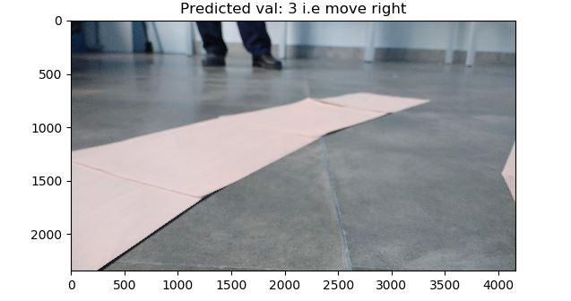

# Path Follower
This project is aimed to use convolutional neural network trained on path images to detect the current position of a robot and decide the movement of robot based on the real-time images taken from the mounted camera on the robot.
 
### Dataset:
Training data is converted from reshaped .jpg images to tfrecords and present in "Dataset/" directory. (ref : BuildTFrecords.py)

### Training:
Using the tfrecord files a Convolutional neural network has been trained to detect the action to be taken by robot to be on the path.

### Optimizing for inference:
Trained model was saved and then optimized using tensorflow's "tensorflow.python.tools.optimize_for_inference" function.

### Model Sample Output on Videos/Images: 
Use "run_with_saved_model.py" to run inference on videos/images. 
NOTE: do change image path on line 24 of run_with_saved_model.py
 
|Sample output|
|:-:|
||

### Work to be done:
- Using optimized model, setup raspberry pi to manipulate motors of a robot based on the model inference.

